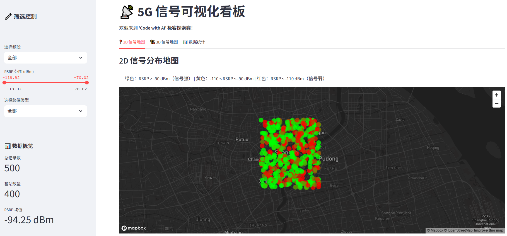
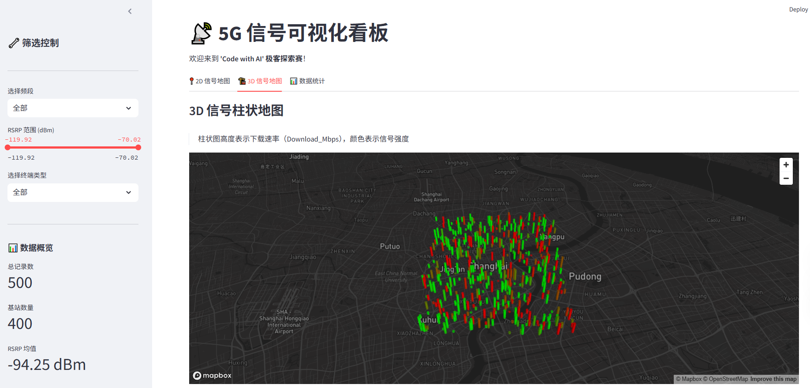
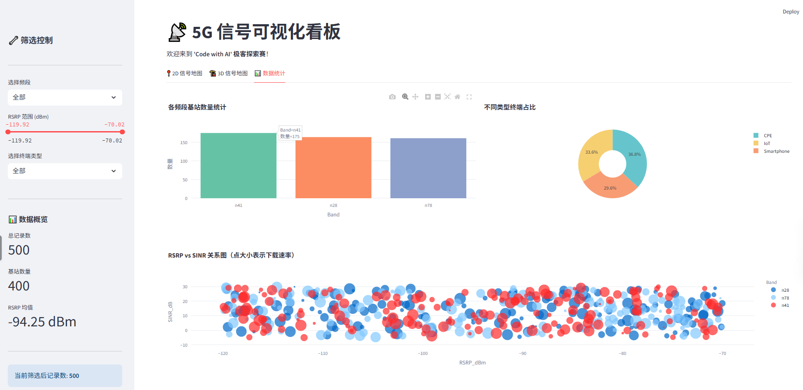

# � 5G 信号可视化看板

## 项目简介

本项目是"Code with AI"海选赛的参赛作品，基于 Streamlit + PyDeck + Plotly 构建的 5G 路测数据交互式可视化看板。

## 功能特性

### 基础功能
- ✅ 数据加载：使用 pandas 读取 CSV 数据，支持缓存
- ✅ 2D 信号地图：根据 RSRP 变色（绿=强信号，黄=中，红=弱）
- ✅ 数据统计图表：频段柱状图 + 终端类型饼图 + RSRP/SINR 散点图

### 进阶功能
- ✅ 侧边栏联动筛选：频段下拉菜单 + RSRP 滑动条 + 终端类型筛选
- ✅ 3D 柱状地图：信号点以 3D 形式展示，高度随下载速率变化
- ✅ 单元测试：pytest 测试用例覆盖核心函数

## 快速运行

```bash
# 1. 安装依赖
pip install -r requirements.txt

# 2. 启动应用
streamlit run app.py

# 3. 浏览器自动打开 http://localhost:8501
```

## 项目结构

```
├── app.py                 # 主应用代码
├── requirements.txt       # Python 依赖
├── test_app.py           # 单元测试
├── data/
│   └── signal_samples.csv # 5G 路测数据
├── AI_PROMPTS.md         # AI 交互日志
└── README.md             # 项目文档
```

## 数据说明

| 字段 | 说明 |
|------|------|
| Latitude/Longitude | 经纬度 |
| CellID | 小区ID |
| Band | 频段 (n28/n41/n78) |
| RSRP_dBm | 信号强度 |
| SINR_dB | 信噪比 |
| TerminalType | 终端类型 (Smartphone/CPE/IoT) |
| Download_Mbps | 下载速率 |

## 信号强度配色规则

| RSRP 范围 | 颜色 | 信号质量 |
|-----------|------|----------|
| > -90 dBm | 🟢 绿色 | 强 |
| -110 ~ -90 dBm | 🟡 黄色 | 中 |
| < -110 dBm | 🔴 红色 | 弱 |

## 运行截图




## 技术栈

- **Web 框架**: Streamlit
- **地图渲染**: PyDeck
- **图表可视化**: Plotly Express
- **数据处理**: Pandas + NumPy
- **测试框架**: Pytest
